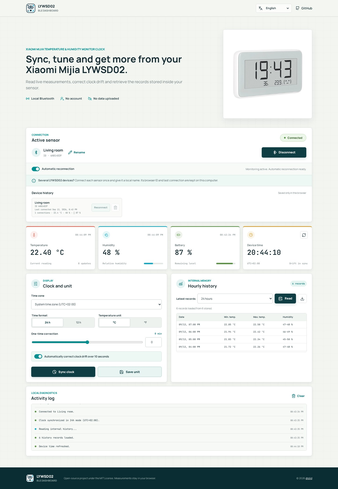

  

<h1 align="center">📡 LYWSD02 BLE Dashboard 🌡️</h1>

  <strong>Get your Xiaomi Mijia LYWSD02 back on time.</strong> 
  Update its clock, choose your display settings and check your room’s temperature — straight from your browser, or automatically with Home Assistant.

  
  

  💻 Use your computer · 📦 No app to install · 🔒 No account · 🌍 9 languages

  
  
  
  

   
  Dashboard preview with example readings.

  <a href="#getting-started">📋 Getting started</a> ·
  <a href="#features">✨ Features</a> ·
  <a href="#home-assistant">🏠 Home Assistant</a> ·
  <a href="#languages">🌍 Languages</a> ·
  <a href="#multiple-sensors">📡 Multiple sensors</a> ·
  <a href="#connection-help">💬 Connection help</a>

---

## 📋 Update your device in a few clicks

You need a **Xiaomi Mijia LYWSD02** and a **Bluetooth-enabled Windows, Mac or Linux computer**. Open the dashboard in **Chrome, Edge or a compatible Chromium browser**; Bluetooth availability also depends on your operating system and adapter.

1. **Open [the dashboard](https://drslid.github.io/LYWSD02_BLE_Dashboard/)** and turn on your computer’s Bluetooth. Keep the sensor nearby.
2. **Click “Find a sensor”** and select your LYWSD02 in the browser’s device list.
3. **Update the clock.** Choose your time zone, then click **“Sync clock”**. The 12-hour display is only available on the LYWSD02MMC; the plain LYWSD02 always shows 24 hours.
4. **Set the temperature unit.** Select **°C** or **°F**, then click **“Save unit”** to apply it to the device.

Your temperature, humidity and battery level appear once connected. Click **“Rename”** to give the sensor a familiar name, such as *Living room* or *Bedroom*.

> ⏰ Automatic clock correction is enabled by default: it corrects drift greater than 10 seconds when you connect. Turn it off if you prefer to synchronize manually.

> 📱 Visiting from your phone? The site provides a link to copy and open on your computer. Safari and Firefox cannot connect through this dashboard.

## ✨ What you can do

| | What it does |
| --- | --- |
| ⏰ **Keep the right time** | Synchronize the clock with your computer, select your time zone and correct clock drift automatically. |
| ⚙️ **Choose your display** | Switch between Celsius/Fahrenheit, and 12/24-hour time on the LYWSD02MMC. |
| 🌡️ **Check your room** | See live temperature and humidity, plus the sensor’s battery level. |
| 📊 **Read past measurements** | Retrieve up to 96 hourly records with minimum/maximum values and download them as CSV. |
| 🏷️ **Find your sensors again** | Save local names and reconnect from your device history. |
| 🔄 **Recover from a drop** | Retry automatically, up to 10 attempts. Stop a connection at any time. |
| 🏠 **Automate it** | Let [Home Assistant](#home-assistant) set every clock each night and after daylight saving changes. |

The connection is local. Measurements and saved sensor names stay in your browser, with no account or cloud service required.

## 🏠 Keep every clock on time with Home Assistant

The **LYWSD02 Clock Sync** integration sets your clocks from Home Assistant: right away when you add them, then every night at 04:00. After a daylight saving change, clocks are corrected within the hour, even without a schedule. Each sync also brings back what the clock measured: temperature, humidity, battery and its hourly records. Every setting is on the device page; there is nothing to write in YAML.

You need **Home Assistant 2025.2 or later**, **[HACS](https://www.hacs.xyz/)** and working **Bluetooth** in Home Assistant: a local adapter or an [ESPHome Bluetooth proxy](https://esphome.io/components/bluetooth_proxy/) with active connections.

1. **Add the integration to HACS**, then select **Download**:

   

2. **Restart Home Assistant.**
3. **Add your clocks.** Home Assistant discovers nearby LYWSD02 clocks: select **Add** on the notification. You can also add one yourself:

   

That’s it: each clock is synchronized immediately.

> Without HACS, copy `custom_components/lywsd02_sync` into the `custom_components` folder of your Home Assistant configuration, then restart.

### Set each clock from its device page

Open **Settings → Devices & services → LYWSD02 Clock Sync**, then select a clock. Its **Configuration** card holds every setting. Changes reach the clock right away, or as soon as it is in range.

| Setting | Choices |
| --- | --- |
| **Automatic sync** | **Every day** *(default)*, **Every week**, **Every month** or **Manual only** |
| **Sync time** | Time of the automatic sync, 04:00 by default |
| **Weekly sync day** | Day of the weekly sync |
| **Monthly sync day** | 1 to 28, so that every month has it |
| **Temperature unit** | °C or °F on the clock screen |
| **Time format** | 24 h or 12 h, on the LYWSD02MMC only |
| **Time correction** | Keeps the clock ahead (+) or behind (−) by up to 120 minutes |

Until you choose a temperature unit or time format here, the clock keeps its own.

For an advanced schedule, select **Configure** on the integration, then **Custom (cron expression)**: five fields, e.g. `30 3 * * 1` for every Monday at 03:30. Custom schedules keep **at least one hour** between two syncs, because each connection uses coin-cell energy.

Whatever you choose:

- **Daylight saving changes** are corrected within the hour.
- **A clock out of range** is looked for every minute and synchronized as soon as an adapter can reach it.
- **A failed connection** is retried after 5, 15, 30 and then 60 minutes.

### What you get

| Entity | What it shows |
| --- | --- |
| **Sync clock** button | Sets the clock now. If no adapter hears the clock, it looks for it for up to a minute; if the connection drops, it reconnects. Use it in dashboards and automations with `button.press`. |
| **Last sync** | When the clock was last set. |
| **Next sync** | When the next scheduled sync runs. |
| **Sync status** | *On time*, *Searching for the clock* or *Failed, retrying*. |
| **Temperature** and **Humidity** | What the clock measured during the last sync. The temperature follows the unit system of Home Assistant. |
| **Minimum** and **Maximum temperature (24 h)**, **Minimum** and **Maximum humidity (24 h)** | Extremes of the hourly records the clock kept during the 24 hours before the last sync. |
| **Battery** *(diagnostic)* | Battery level read during the last sync. |
| **Clock time** *(diagnostic)* | The time the clock showed right after the last sync, time correction included. |
| **Drift before last sync** *(diagnostic)* | How far the clock had drifted, in seconds. |

These readings change at each sync, so they follow the schedule you chose. For live values between syncs, the [Xiaomi BLE](https://www.home-assistant.io/integrations/xiaomi_ble/) integration of Home Assistant listens to what the clock broadcasts.

The clock keeps the minimum and maximum temperature and humidity of every hour. Each sync reads the hours recorded since the previous one (up to a week the first time) and adds them to the statistics of Home Assistant, even the hours between two syncs. To see them, add a **Statistics graph** card and choose **LYWSD02 (…) Temperature records** or **Humidity records**: each hour has its minimum, its maximum and, as the clock keeps no average, the midpoint between them as mean. Each record is placed on the hour it covers with the gap measured between the clock and Home Assistant before the time is set.

The settings are entities too, so automations can change them. The clock uses the time zone configured in Home Assistant. The integration speaks the nine languages of the dashboard.

### If a clock is not synchronized

- **Searching for the clock:** no Bluetooth adapter can reach it right now. Press **Sync clock** to look for it for up to a minute: it is synchronized as soon as an adapter hears it. After 5 minutes the log explains why, and **Settings → Repairs** shows what to do when the setup is the cause:
  - *Only heard by passive Bluetooth proxies*: enable connections on an ESPHome proxy near the clock with `active: true` under `bluetooth_proxy:`, or bring a Bluetooth adapter closer. Shelly devices only listen; they cannot set a clock.
  - *No Bluetooth adapter can connect*: add a Bluetooth adapter, or an ESPHome proxy with `active: true`.
  - Without a repair, the clock is out of range: move it closer to an adapter or proxy.
- **Failed, retrying:** a proxy may be out of connection slots. Home Assistant retries by itself; the **Sync clock** button reconnects a few times, then shows the exact error.
- **12 h has no effect:** only the LYWSD02MMC supports it. A plain LYWSD02 stays in 24 h and its time is still set.

## 🌍 Use the dashboard in your language

English is the default. Choose your language in the dashboard or open it directly below. Bookmark your language’s link to open it directly next time.

  <a href="https://drslid.github.io/LYWSD02_BLE_Dashboard/">English</a> ·
  <a href="https://drslid.github.io/LYWSD02_BLE_Dashboard/fr/">Français</a> ·
  <a href="https://drslid.github.io/LYWSD02_BLE_Dashboard/es/">Español</a> ·
  <a href="https://drslid.github.io/LYWSD02_BLE_Dashboard/it/">Italiano</a> ·
  <a href="https://drslid.github.io/LYWSD02_BLE_Dashboard/de/">Deutsch</a> 
  <a href="https://drslid.github.io/LYWSD02_BLE_Dashboard/ar/">العربية</a> ·
  <a href="https://drslid.github.io/LYWSD02_BLE_Dashboard/zh/">中文</a> ·
  <a href="https://drslid.github.io/LYWSD02_BLE_Dashboard/pt/">Português</a> ·
  <a href="https://drslid.github.io/LYWSD02_BLE_Dashboard/hi/">हिन्दी</a>

Arabic includes a right-to-left layout.

## 📡 Have more than one sensor?

Connect each sensor once and give it a name with **“Rename”**. Your **Device history** keeps its name, last connection and latest readings, so you can recognize it next time.

- **Reconnect** connects directly to a saved sensor when your browser allows it.
- **Select again** opens the browser’s device list. The dashboard checks that you chose the saved sensor before connecting.
- The **trash icon** removes a sensor from your dashboard history.

The names are saved in this browser. They do not rename entries in the browser’s Bluetooth chooser or follow you to another computer.

## 💬 Need help connecting?

- **The connection is taking too long:** click **“Stop connecting”**. It remains available during connection attempts and retry delays. If the browser’s device chooser is open, use its **Cancel** button.
- **The connection drops:** leave **Automatic reconnection** enabled for up to **10 attempts**. Turning it off prevents further retries.
- **Bluetooth is unavailable:** check that Bluetooth is turned on, use a compatible browser and open the [official dashboard](https://drslid.github.io/LYWSD02_BLE_Dashboard/) on your computer.
- **Something still looks wrong:** [report an issue](https://github.com/drslid/LYWSD02_BLE_Dashboard/issues/new) with your browser, operating system and the message shown in the activity log.

## 🤝 Help improve the dashboard

Found a bug, have a feature idea or spotted a translation to improve? [Open an issue](https://github.com/drslid/LYWSD02_BLE_Dashboard/issues). Contributions and pull requests are welcome.

For local setup, tests and device protocol details, see the [contributor and technical notes](docs/DEVELOPMENT.md).

## 👥 Contributors

Released under the [MIT License](LICENSE).

<a href="#top">⬆️ Back to top</a>

